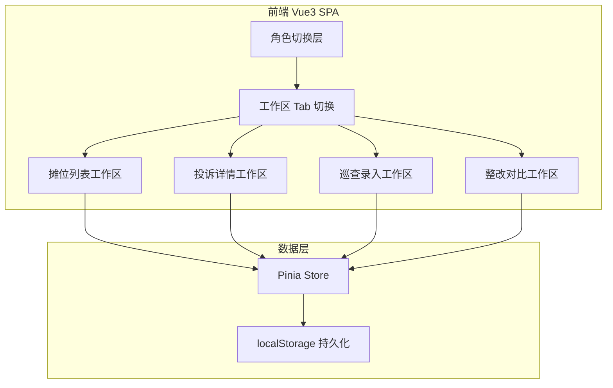
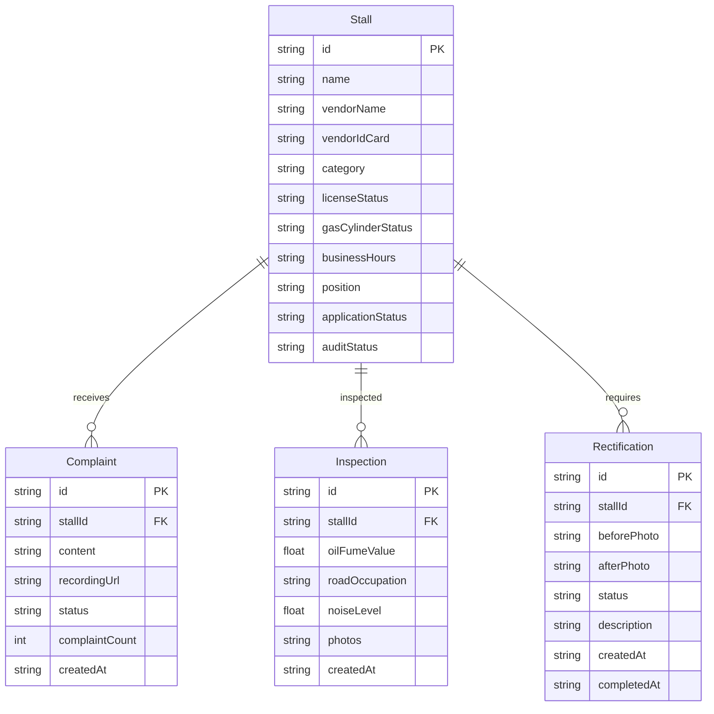

## 1. 架构设计

纯前端 SPA 架构，无后端服务。所有业务数据通过 Pinia Store 管理，自动同步到浏览器 localStorage。

## 2. 技术说明

- **前端框架**：Vue 3 + TypeScript + Vite
- **样式方案**：Tailwind CSS
- **路由**：Vue Router（单页面 Tab 切换为主）
- **状态管理**：Pinia + pinia-plugin-persistedstate（localStorage 持久化）
- **图表**：Chart.js + vue-chartjs（油烟趋势折线图）
- **图标**：lucide-vue-next
- **后端**：无
- **数据库**：localStorage

## 3. 路由定义

| 路由 | 用途 |
|------|------|
| / | 夜市治理工作台主页面，包含角色切换和四个工作区 Tab |

## 4. API 定义

无后端 API，所有数据通过 localStorage 读写。

## 5. 服务端架构

不适用

## 6. 数据模型

### 6.1 数据模型定义

### 6.2 数据定义

使用 TypeScript 接口定义，通过 Pinia Store + localStorage 持久化。初始数据在首次加载时写入 localStorage。

关键枚举：
- `LicenseStatus`: complete / incomplete / expired
- `GasCylinderStatus`: safe / warning / danger
- `AuditStatus`: pending / approved / rejected
- `RectificationStatus`: pending / in_progress / completed
- `ComplaintStatus`: pending / processing / resolved
